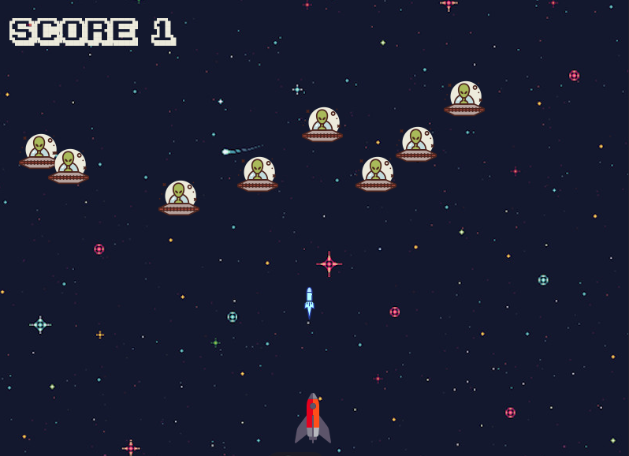

This is Martizianos War, a space invaders style game project made using Python and Pygame library. It's a work in progress and I'll be upgrading it and adding new features.




## Features

 - Use Left Arrow and Right Arrow keys to move Spaceship
 - Use the Space Bar to shoot your enemies
 - You can Mute music with 'm' key and play it with 'p' key
 - Use Escape key to exit game
 - If you loose, yo can press space bar key to restart


## Requirements:

- Python 3

- Pygame

## Usage

Open a terminal and go to the directory called 'Martzianos' which contains all project files.
Enter this command to run the application:
```
python3 main.py
```
or, in case you are still using python 2, enter this command:

```
python main.py
```
